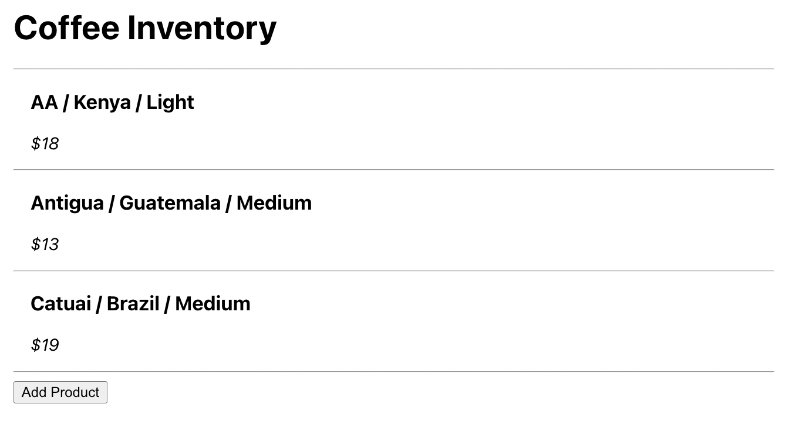
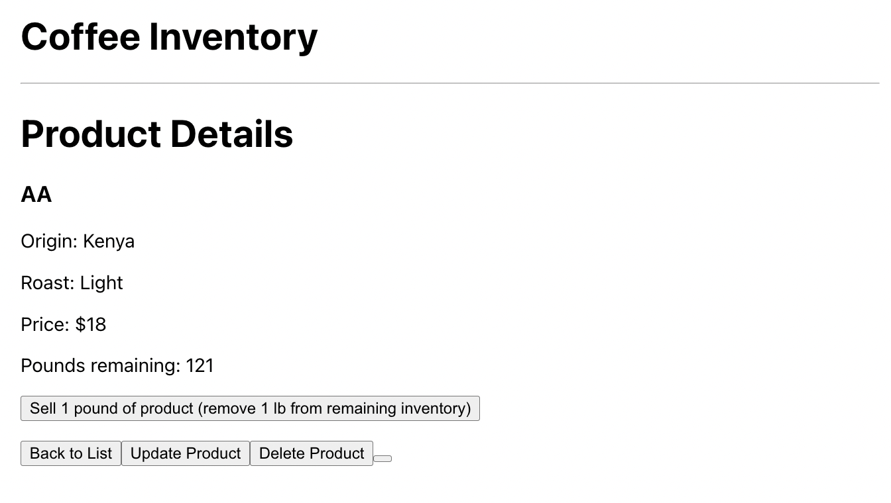

# Product Inventory Tracker

#### By Mike Wilkes

#### An application to track product inventory

## Technologies Used

* Javascript
* React
* JSX

## Description

This application serves as an inventory management system designed for a coffee shop, although it can be easily adapted for any inventory tracking purpose. The system provides users with the following features:
1.  View and Add Products:
    -   Users can add coffee bean types to a list using a form.
    -   The added products are then displayed in the product list.
2.  Detailed Product Information:
    -   Clicking on a product in the list displays its details, including the product's name, origin, roast level, price, and the remaining inventory in terms of pounds.
3.  Update and Delete Products:
    -   Users have the ability to update product details, or delete products from the inventory when they are no longer available.
4.  Inventory Management:
    -   Users can click a button to "sell" one pound of a selected product, keeping the listing up-to-date with current stock. When adding a new product to the list, all items automatically start with 130 pounds of inventory.

| Product Inventory List         | Product Details                |
| ------------------------------ | ------------------------------ |
|  |  |

## Component Diagram 

## Setup/Installation Requirements

* Clone this repository
* Navigate to the project directory
* Install all required dependencies by opening a terminal and running:
  * `npm install`
* Start the development server by running:
  * `npm start`

### Known Bugs
There is a tiny, blank, mystery button on the product detail page. It doesn't do anything.

## Roadmap
### Future development could include:
* Page styling/layout improvements.
* Ability to populate an item's existing values on the form when editing an item.

## License

MIT License

Copyright (c) _2023_ _Mike Wilkes_ 